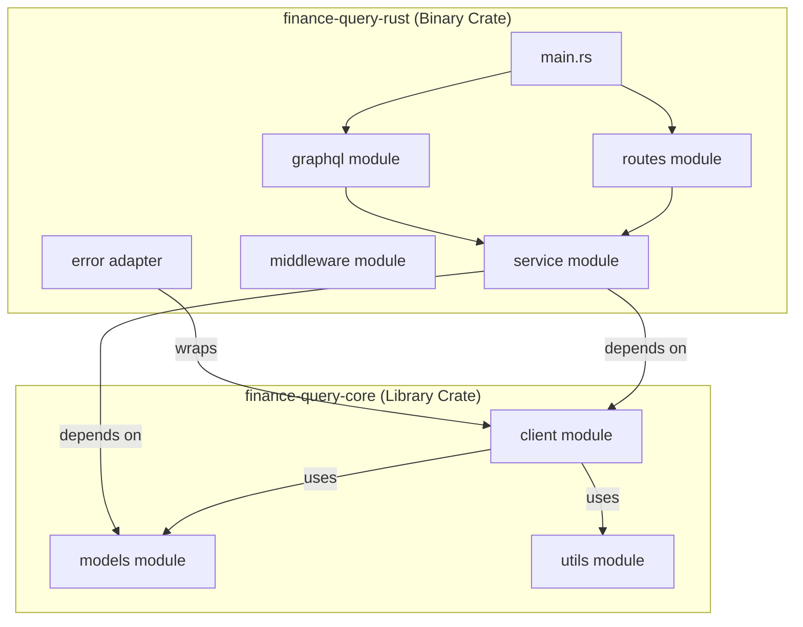
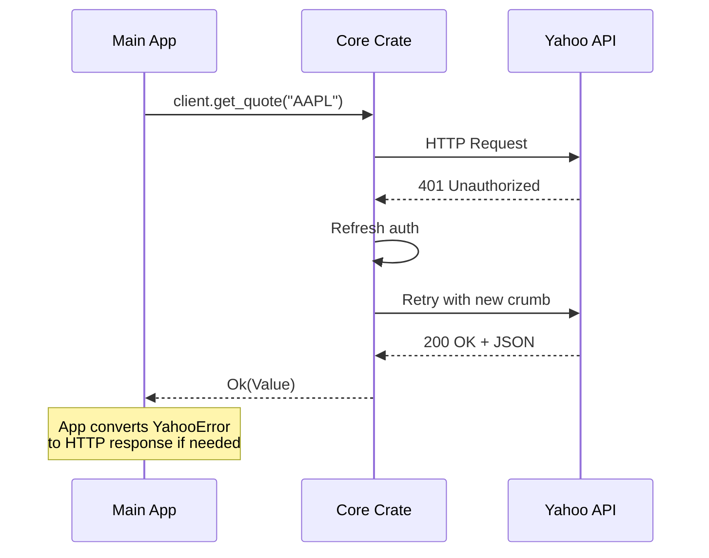

# Design Document: Crate Extraction

## Overview

This design describes the extraction of the Yahoo Finance client functionality from `finance-query-rust` into a standalone, publishable crate called `finance-query-core`. The extraction follows Rust's workspace pattern, allowing both crates to coexist and be developed together while maintaining clear separation of concerns.

The core crate will be framework-agnostic, containing only the HTTP client, authentication logic, data models, and utilities. The main application will become a thin web layer that depends on the core crate.

## Architecture



### Workspace Structure

```
finance-query-rust/
├── Cargo.toml              # Workspace root + main app
├── finance-query-core/
│   ├── Cargo.toml          # Core library crate
│   ├── README.md
│   ├── LICENSE
│   └── src/
│       ├── lib.rs          # Public API exports
│       ├── client/
│       │   ├── mod.rs
│       │   ├── error.rs
│       │   ├── fetch_client.rs
│       │   ├── yahoo_auth.rs
│       │   ├── yahoo_client.rs
│       │   └── scraper.rs
│       ├── models/
│       │   ├── mod.rs
│       │   ├── quote.rs
│       │   ├── historical.rs
│       │   ├── news.rs
│       │   ├── search.rs
│       │   ├── financials.rs
│       │   ├── movers.rs
│       │   ├── indices.rs
│       │   ├── holders.rs
│       │   ├── analysts.rs
│       │   ├── sectors.rs
│       │   └── earnings_transcripts.rs
│       └── utils/
│           ├── mod.rs
│           └── financials_constants.rs
└── src/                    # Main app (unchanged location)
    ├── main.rs
    ├── routes/
    ├── graphql/
    ├── service/
    └── middleware/
```

## Components and Interfaces

### Core Crate Public API

```rust
// finance-query-core/src/lib.rs
pub mod client;
pub mod models;
pub mod utils;

// Re-exports for convenience
pub use client::{FetchClient, YahooAuthManager, YahooFinanceClient};
pub use client::error::YahooError;
```

### Error Type (Framework-Agnostic)

The error type in the core crate will NOT implement `actix_web::ResponseError`. Instead, it will be a pure `thiserror` enum:

```rust
// finance-query-core/src/client/error.rs
#[derive(Debug, thiserror::Error)]
pub enum YahooError {
    #[error("Authentication failed: {0}")]
    AuthFailed(String),

    #[error("Resource not found: {0}")]
    NotFound(String),

    #[error("Rate limit exceeded")]
    RateLimited,

    #[error("HTTP error: {0}")]
    HttpError(u16, String),

    #[error("Parse error: {0}")]
    ParseError(String),

    #[error("Network error: {0}")]
    NetworkError(#[from] reqwest::Error),
}
```

### Web Error Adapter (Main App)

The main application will provide its own adapter for web responses:

```rust
// src/error.rs (in main app)
use actix_web::{HttpResponse, ResponseError};
use finance_query_core::YahooError;

impl ResponseError for YahooError {
    fn error_response(&self) -> HttpResponse {
        // ... web-specific error handling
    }
}
```

### Client Components

| Component | Location | Responsibility |
|-----------|----------|----------------|
| `YahooFinanceClient` | `client/yahoo_client.rs` | Main API client with all Yahoo Finance endpoints |
| `YahooAuthManager` | `client/yahoo_auth.rs` | Cookie/crumb authentication management |
| `FetchClient` | `client/fetch_client.rs` | Low-level HTTP client with proxy support |
| `YahooError` | `client/error.rs` | Error types for all client operations |

### Model Components

All models will be moved to the core crate with `Serialize`, `Deserialize`, `Debug`, and `Clone` derives:

| Model | File | Description |
|-------|------|-------------|
| `Quote`, `SimpleQuote`, `DetailedQuote` | `models/quote.rs` | Stock quote data |
| `HistoricalData`, `TimeRange`, `Interval` | `models/historical.rs` | Historical price data |
| `News` | `models/news.rs` | News articles |
| `SearchResult`, `SearchResponse` | `models/search.rs` | Search results |
| `FinancialStatement` | `models/financials.rs` | Financial statements |
| `EarningsTranscript` | `models/earnings_transcripts.rs` | Earnings call transcripts |

## Data Models

All existing models will be preserved with their current structure. The key change is removing any web-framework-specific attributes or implementations.

### Model Trait Requirements

All public model types MUST derive:
- `Debug` - for logging and debugging
- `Clone` - for ownership flexibility
- `Serialize` - for JSON output
- `Deserialize` - for JSON parsing

## Correctness Properties

*A property is a characteristic or behavior that should hold true across all valid executions of a system-essentially, a formal statement about what the system should do. Properties serve as the bridge between human-readable specifications and machine-verifiable correctness guarantees.*

### Property 1: Model Serialization Round-Trip

*For any* valid model instance (Quote, HistoricalData, SearchResult, etc.), serializing to JSON and deserializing back SHALL produce an equivalent value.

**Validates: Requirements 2.2**

This property ensures that all models correctly implement serde traits and that no data is lost during serialization/deserialization cycles.

## Error Handling

### Error Flow



### Error Categories

| Error | Core Crate Behavior | Main App Behavior |
|-------|---------------------|-------------------|
| `AuthFailed` | Return error after retry | Convert to 401 response |
| `NotFound` | Return error immediately | Convert to 404 response |
| `RateLimited` | Return error immediately | Convert to 429 response |
| `HttpError` | Return with status code | Convert to appropriate response |
| `ParseError` | Return error immediately | Convert to 500 response |
| `NetworkError` | Return error immediately | Convert to 502 response |

## Testing Strategy

### Dual Testing Approach

Both unit tests and property-based tests will be used:

- **Unit tests**: Verify specific examples, edge cases, and error conditions
- **Property-based tests**: Verify universal properties across all inputs

### Property-Based Testing Framework

The crate will use `proptest` for property-based testing in Rust.

```toml
[dev-dependencies]
proptest = "1.4"
```

### Test Organization

```
finance-query-core/
└── src/
    ├── lib.rs
    ├── client/
    │   └── mod.rs      # Unit tests inline
    └── models/
        ├── mod.rs
        └── quote.rs    # Property tests for serialization
```

### Property Test Example

```rust
// In models/quote.rs
#[cfg(test)]
mod tests {
    use super::*;
    use proptest::prelude::*;

    // **Feature: crate-extraction, Property 1: Model Serialization Round-Trip**
    proptest! {
        #![proptest_config(ProptestConfig::with_cases(100))]
        #[test]
        fn quote_roundtrip(
            symbol in "[A-Z]{1,5}",
            name in "[A-Za-z ]{1,50}",
            price in "[0-9]{1,4}\\.[0-9]{2}",
        ) {
            let quote = SimpleQuote {
                symbol,
                name,
                price,
                pre_market_price: None,
                after_hours_price: None,
                change: "0.00".to_string(),
                percent_change: "0.00%".to_string(),
                logo: None,
            };
            
            let json = serde_json::to_string(&quote).unwrap();
            let parsed: SimpleQuote = serde_json::from_str(&json).unwrap();
            
            assert_eq!(quote.symbol, parsed.symbol);
            assert_eq!(quote.name, parsed.name);
            assert_eq!(quote.price, parsed.price);
        }
    }
}
```

### Unit Test Coverage

Unit tests will cover:
- Client construction with valid/invalid parameters
- Error type creation and display
- Model field access and conversions
- Utility function behavior
